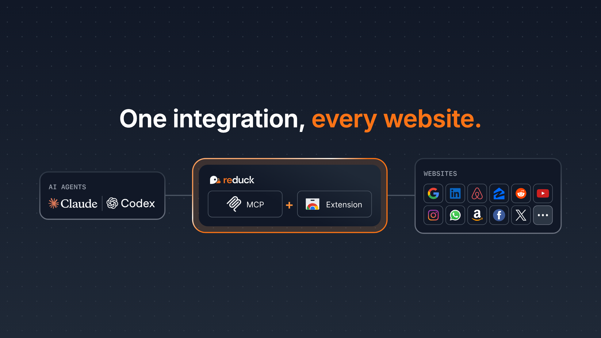

2026 has been the year for coding, cyber, and math agents, but broader knowledge work — finance, ops, growth, and the rest — hasn't been as impacted, especially in enterprise setups.

Connecting your agent to the key apps you use is a remaining challenge for large-scale adoption.

Today, even if agents can use Computer Use to automate sites with no API — LinkedIn, Reddit, your custom ERP — Computer Use is inadequate for complex and heavy workloads because it's:

- **Unreliable** — results vary and get worse as context size explodes
- **Slow** — each step requires slow thinking to decide the next browser action
- **Expensive** — context fills up quickly and complex tasks hit rate limits

## Introducing Reduck MCP



That's why we built Reduck MCP: the easiest way for an agent to integrate and automate any site you use.

Reduck MCP lets agents discover, run, and create browser automation scripts that serve as tools. Scripts run in your own Chrome, through our extension, which means your agent works where you're already logged in — no credentials exposure, and the same fingerprint, so no bot detection.

You can try it for free at [start.reduck.ai](https://start.reduck.ai/?utm_source=blog&utm_medium=referral&utm_campaign=introducing-reduck-mcp&utm_content=cta-start).

## Demo



You can see the product in action in this demo, where Claude does GEO monitoring by probing ChatGPT on a prompt we want to position on, using Reduck.

Reduck can be used for many other use cases, such as:

- Price / review monitoring on Amazon
- Reddit monitoring and posting
- Facebook posting

...and more at [reduck.ai/explore/scripts](https://reduck.ai/explore/scripts?utm_source=blog&utm_medium=referral&utm_campaign=introducing-reduck-mcp&utm_content=use-cases).

## Get started in minutes

You can connect your agent to Reduck MCP and automate complex flows on Reddit, WhatsApp, or LinkedIn in literally minutes:

1. Create an account at [reduck.ai/#signin](https://reduck.ai/?utm_source=blog&utm_medium=referral&utm_campaign=introducing-reduck-mcp&utm_content=signup#signin)
2. Install our [Chrome extension](https://chromewebstore.google.com/detail/reduck/koccidjchcojlmgkdhibpgjbnhcoopio) and pair it with your account
3. Install Reduck MCP

On Claude Code CLI:

```bash
claude mcp add reduck --transport http --scope user https://mcp.reduck.ai
```

On Codex CLI:

```bash
codex mcp add reduck --url https://mcp.reduck.ai
```

For other MCP clients, see our [Onboarding Guide](https://docs.reduck.ai/other-clients/?utm_source=blog&utm_medium=referral&utm_campaign=introducing-reduck-mcp&utm_content=onboarding-guide).

Start a new session and get going with your first automation. You can try a prompt like:

```
Using Reduck MCP, search on Google the top 3 latest posts of the week on "AI Agents" on LinkedIn. Then return the profiles of potential buyers of B2B AI agents.
```

## Key features

Reduck MCP has a unique blend of features that make it a first-class tool for your agent to automate complex web tasks:

- **Official Script Library for quick starts** — get going in minutes with the official library of scripts we maintain
- **Stealthy and private extension** — Reduck leverages your browser's logged-in state, fingerprint, and residential IP, so detection risk is minimal and credentials never leave your machine
- **Parallel runs** — scripts can run in parallel with a single tool call for fast iteration

## Build your own integrations

If our Official Script Library doesn't contain the exact scripts you need — say, a local government portal or a custom-made ERP — you can use Reduck MCP to build your own scripts for your agent to use.

Just prompt your agent to build a new script, for example:

```
Use Reduck MCP to create scripts for trends.google.com keywords.
```

Once done, your scripts can be discovered by your agent through Reduck MCP and found at [reduck.ai/projects](https://reduck.ai/projects/?utm_source=blog&utm_medium=referral&utm_campaign=introducing-reduck-mcp&utm_content=projects).

## Learn more

- [Core concepts](https://docs.reduck.ai/scripts/?utm_source=blog&utm_medium=referral&utm_campaign=introducing-reduck-mcp&utm_content=core-concepts) — key concepts, such as scripts and browser execution
- [API](https://docs.reduck.ai/api-reference/?utm_source=blog&utm_medium=referral&utm_campaign=introducing-reduck-mcp&utm_content=api) — how to call Reduck scripts programmatically from HTTP endpoints instead of MCP calls
- [CLI](https://docs.reduck.ai/cli/?utm_source=blog&utm_medium=referral&utm_campaign=introducing-reduck-mcp&utm_content=cli) — a strong alternative for parallel calls, saving script run outputs to disk locally, and piping them to other apps
- [Discord](https://discord.gg/ARgNAZFunD) — chat with us about issues, ideas, and more
